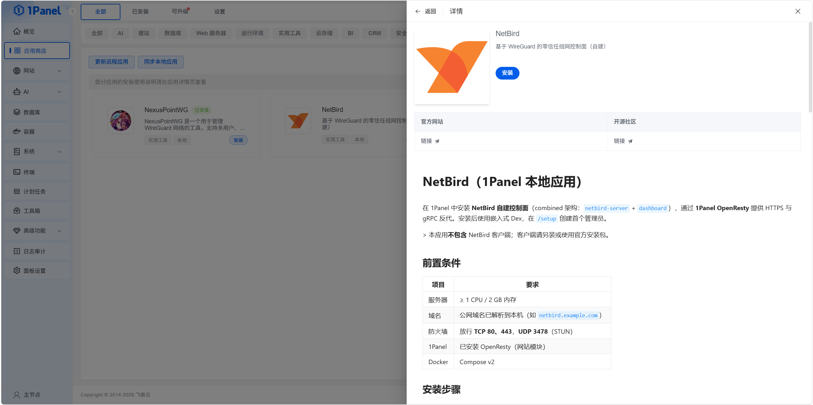
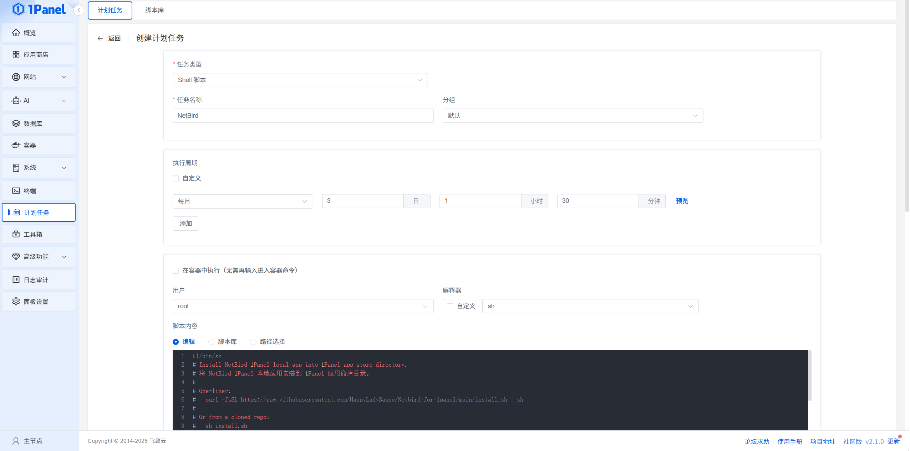
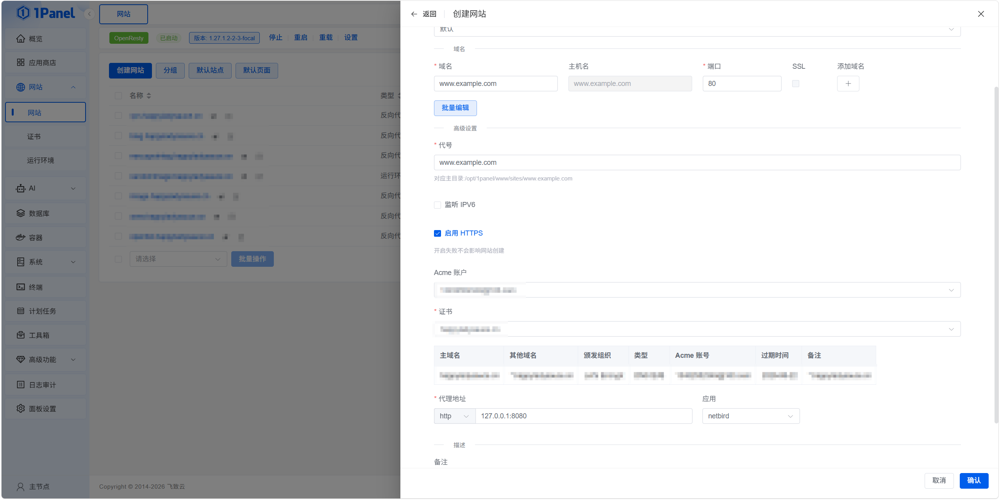

# NetBird for 1Panel

1Panel 本地应用包：一键部署 [NetBird](https://netbird.io/) 自建控制面与 [Traefik](https://traefik.io/) 反向代理。



## 目录结构

```text
Netbird/                          # 复制到 /opt/1panel/resource/apps/local/Netbird
Traefik/                          # 复制到 /opt/1panel/resource/apps/local/Traefik
install.sh                        # 一键安装 NetBird + Traefik 到 1Panel
docs/
  images/                         # 文档配图
  openresty/
    1panel-openresty.md           # OpenResty 必用手动配置说明（必读）
    proxy/                        # 可直接覆盖到 1Panel 站点的代理片段
      netbird-server.conf
      root.conf
      README.md
reference/golden/                 # 官方脚本生成的参考配置
```

## 快速开始

### 1. 安装应用

在服务器上执行（需已安装 1Panel，默认路径 `/opt/1panel`）：

```bash
curl -fsSL https://raw.githubusercontent.com/HappyLadySauce/Netbird-for-1panel/main/install.sh | sh
```

也可在 **计划任务** 中新建 Shell 脚本任务执行上述命令（用户 `root`，宿主机执行，勿勾选「在容器中执行」）。

`install.sh` 会**先删除** `/opt/1panel/resource/apps/local/Netbird`（及旧目录 `netbird`）、`Traefik` 再写入新文件。若需保留可设：`PANEL_INSTALL_SKIP_CLEANUP=1`，或分别设 `NETBIRD_INSTALL_SKIP_CLEANUP=1` / `TRAEFIK_INSTALL_SKIP_CLEANUP=1`。



然后在 **应用商店 → 更新应用列表** 中安装 **NetBird** 与 **Traefik**（`install.sh` 会同时写入两个本地应用包）。NetBird 按 [Netbird/README.md](Netbird/README.md) 填写安装表单。

### 2. 配置 OpenResty（必做，不能只在面板里点反代）



**不能** 仅在 1Panel 网站面板中添加「反向代理到 8080」。必须将 [docs/openresty/proxy/](docs/openresty/proxy/) 中的文件复制到站点目录：

```bash
DOMAIN="netbird.example.com"
PANEL_WWW="/opt/1panel/www"

install -d "${PANEL_WWW}/sites/${DOMAIN}/proxy"
cp -f docs/openresty/proxy/netbird-server.conf "${PANEL_WWW}/sites/${DOMAIN}/proxy/"
cp -f docs/openresty/proxy/root.conf "${PANEL_WWW}/sites/${DOMAIN}/proxy/"

OR=$(docker ps --format '{{.Names}}' | grep -i openresty | head -1)
docker exec "$OR" openresty -t && docker exec "$OR" openresty -s reload
```

完整步骤、验证命令与 `conf.d` 超时配置见：**[docs/openresty/1panel-openresty.md](docs/openresty/1panel-openresty.md)**。代理片段说明见 **[docs/openresty/proxy/README.md](docs/openresty/proxy/README.md)**。

### 3. 初始化

浏览器访问 `https://<你的域名>/setup` 创建管理员。

Traefik 说明见 [Traefik/README.md](Traefik/README.md)（默认 HTTP/HTTPS `8880`/`8443`，不与 OpenResty 争用 80/443）。

## 手动安装应用包

1. 将 `Netbird/` 与 `Traefik/` 复制到 1Panel `resource/apps/local/`（或执行 `install.sh`）
2. 应用商店 → 更新应用列表 → 安装 NetBird 与 Traefik
3. NetBird：按 [docs/openresty/1panel-openresty.md](docs/openresty/1panel-openresty.md) 配置反向代理

## 许可证

应用包为社区维护；NetBird 与 Traefik 各自遵循其上游许可证。
