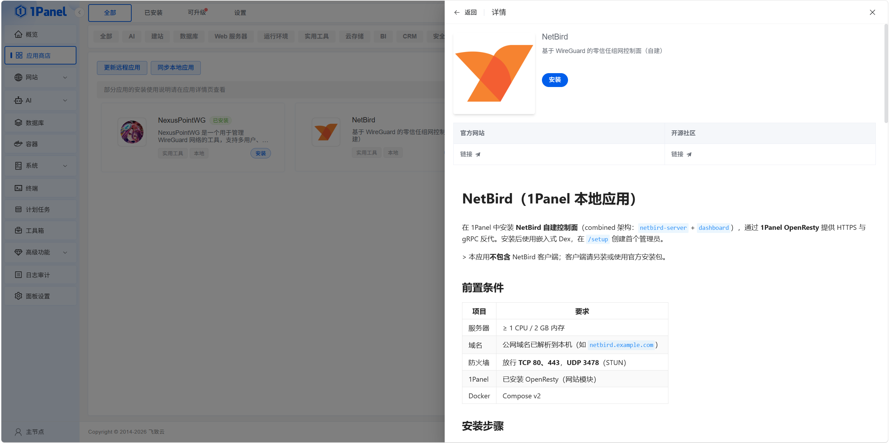
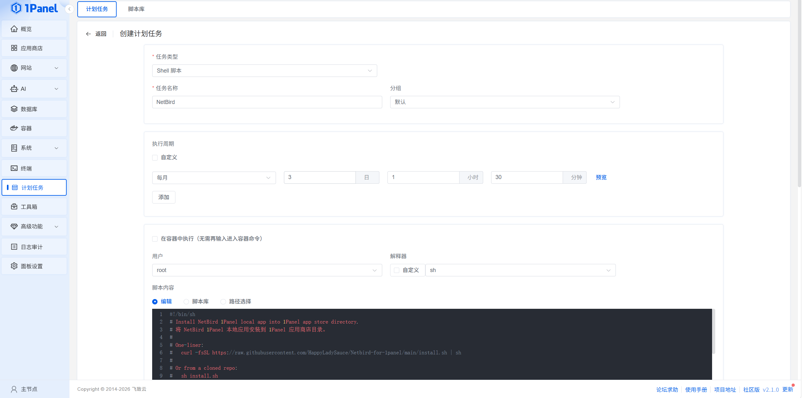
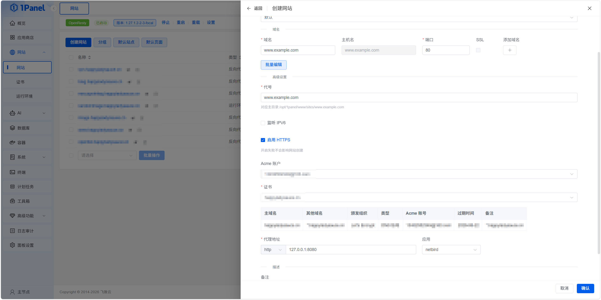

# NetBird for 1Panel

1Panel 本地应用包：一键部署 [NetBird](https://netbird.io/) 自建控制面、[Traefik](https://traefik.io/) 反向代理，以及独立 VPS 上的 **Relay/STUN** 节点（见 [NetbirdRelay](NetbirdRelay/README.md)）。



## 目录结构

```text
Netbird/                          # 复制到 /opt/1panel/resource/apps/local/Netbird
NetbirdRelay/                     # 外部 Relay/STUN 节点（独立 VPS）
Traefik/                          # 复制到 /opt/1panel/resource/apps/local/Traefik
install.sh                        # 一键安装上述应用到 1Panel
auto-update.sh                    # 本机主控 + SSH 远端 Relay 自动更新调度器
netbird-agent-auto-update.sh      # Linux Agent 的 APT 自动更新脚本
install-agent-auto-update.sh      # 安装 Agent systemd 自动更新定时器
systemd/                          # Agent 自动更新的 service / timer
docs/
  images/                         # 文档配图
  openresty/
    1panel-openresty.md           # OpenResty 必用手动配置说明（必读）
    proxy/                        # 主控面 HTTP/gRPC 代理片段
      netbird-server.conf
      root.conf
      README.md
    relay/                        # 外部 Relay stream 透传配置
      relay-stream.conf
      README.md
    双节点部署指南.md           # 主控机 + Relay 机分工与配置（推荐阅读）
reference/golden/                 # 官方脚本生成的参考配置
```

## 部署文档

| 场景 | 文档 |
|------|------|
| **两台机器：主控 + 外部 Relay/STUN** | **[docs/双节点部署指南.md](docs/双节点部署指南.md)** |
| 单机主控 + OpenResty | [Netbird/README.md](Netbird/README.md) |
| 仅 Relay 节点 | [NetbirdRelay/README.md](NetbirdRelay/README.md) |

## 快速开始

### 1. 安装应用

在服务器上执行（需已安装 1Panel，默认路径 `/opt/1panel`）：

```bash
curl -fsSL https://raw.githubusercontent.com/HappyLadySauce/Netbird-for-1panel/main/install.sh | sh
```

也可在 **计划任务** 中新建 Shell 脚本任务执行上述命令（用户 `root`，宿主机执行，勿勾选「在容器中执行」）。

`install.sh` 会**先删除** `/opt/1panel/resource/apps/local/Netbird`（及旧目录 `netbird`）、`Traefik`、`NetbirdRelay` 再写入新文件。若需保留可设：`PANEL_INSTALL_SKIP_CLEANUP=1`，或分别设 `NETBIRD_INSTALL_SKIP_CLEANUP=1` / `TRAEFIK_INSTALL_SKIP_CLEANUP=1` / `NETBIRD_RELAY_INSTALL_SKIP_CLEANUP=1`。



然后在 **应用商店 → 更新应用列表** 中安装 **NetBird** 与 **Traefik**（`install.sh` 会写入全部本地应用包）。NetBird 按 [Netbird/README.md](Netbird/README.md) 填写安装表单。

### 外部 Relay / STUN 节点（双节点）

主控与 Relay **分机部署**时，请直接按 **[docs/双节点部署指南.md](docs/双节点部署指南.md)** 操作（写清每台机器装什么、填什么、`config.yaml` 怎么改、如何验证）。

简要原则：Relay 机只装 **NetBird Relay**；主控 `config.yaml` 的 `stuns` / `relays` 填 **Relay 机域名与端口**（勿写主控 `vpn` 域名）。

### 2. 配置 OpenResty（必做，不能只在面板里点反代）



**不能** 仅在 1Panel 网站面板中添加「反向代理到 8080」。必须将 [docs/openresty/proxy/](docs/openresty/proxy/) 中的文件复制到站点目录：

```bash
DOMAIN="netbird.example.com"
PANEL_WWW="/opt/1panel/www"

install -d "${PANEL_WWW}/sites/${DOMAIN}/proxy"
cp -f docs/openresty/proxy/netbird-server.conf "${PANEL_WWW}/sites/${DOMAIN}/proxy/"
cp -f docs/openresty/proxy/root.conf "${PANEL_WWW}/sites/${DOMAIN}/proxy/"

OR=$(docker ps --format '{{.Names}}' | grep -i openresty | head -1)
docker exec "$OR" openresty -t && docker exec "$OR" openresty -s reload
```

完整步骤、验证命令与 `conf.d` 超时配置见：**[docs/openresty/1panel-openresty.md](docs/openresty/1panel-openresty.md)**。代理片段说明见 **[docs/openresty/proxy/README.md](docs/openresty/proxy/README.md)**。

### 3. 初始化

浏览器访问 `https://<你的域名>/setup` 创建管理员。

Traefik 说明见 [Traefik/README.md](Traefik/README.md)（默认 HTTP/HTTPS `8880`/`8443`，不与 OpenResty 争用 80/443）。

## 自动更新 NetBird 与远端 Relay

仓库根目录的 `auto-update.sh` 可先通过 SSH 更新外部 Relay，成功后再更新本机 NetBird 控制面。两个节点都会先比较运行中容器与拉取后的镜像；仅在镜像变化时短暂停止服务、备份 `data/`、`.env` 与 Compose 文件，然后重建并检查容器状态。备份目录还会生成同名 `.images.txt`，记录升级前的镜像 ID 和版本，供回退时核对。

先执行无副作用检查：

```bash
NETBIRD_RELAY_SSH_HOST="relay.example.com" \
NETBIRD_RELAY_SSH_PORT="22" \
bash auto-update.sh --dry-run
```

确认后执行更新：

```bash
NETBIRD_RELAY_SSH_HOST="relay.example.com" \
NETBIRD_RELAY_SSH_PORT="22" \
bash auto-update.sh
```

默认目录：

| 用途 | 路径 |
|------|------|
| 本机 NetBird | `/opt/1panel/apps/local/Netbird/Netbird` |
| 本机备份 | `/opt/1panel/backup/netbird-auto` |
| 远端 Relay | `/opt/1panel/apps/local/NetbirdRelay/NetbirdRelay` |
| 远端备份 | `/opt/1panel/backup/netbird-relay-auto` |

可在 1Panel **计划任务 → Shell 脚本**中保存上述命令，建议每周低峰期执行一次。SSH 必须使用密钥和 `BatchMode` 非交互登录。可用 `--local-only` / `--relay-only` 单独更新，或用 `--pull-only` 只拉镜像而不重建容器。应用目录中的 `scripts/auto-update.sh` 也可以在对应机器上独立执行。

> 自动更新跟随 Docker `latest` 标签。生产环境应保留备份并关注上游发布说明；脚本不会自动删除历史备份。

### Linux Agent 自动更新

主控/Relay 的 Docker 容器更新与宿主机上的 NetBird Agent 更新是两套独立流程。对于通过 NetBird 官方 APT 源安装的 Linux Agent，可在每台机器执行：

```bash
sudo bash install-agent-auto-update.sh
```

安装后，`netbird-agent-update.timer` 默认每周日 04:15 执行，并随机延迟最多 45 分钟。脚本只升级 `netbird` 包；检测到新版本后先备份 `/etc/netbird` 和 `/var/lib/netbird` 到 `/var/backups/netbird-agent/`，默认保留最近 5 份。可立即升级到指定版本：

```bash
sudo bash install-agent-auto-update.sh --version 0.75.0
```

`--version` 只限制本次执行，之后定时器仍自动跟随 APT 源中的最新版。查看运行时间和更新日志：

```bash
systemctl list-timers netbird-agent-update.timer
journalctl -u netbird-agent-update.service
```

如果更习惯由 1Panel 调度，可不安装 timer，直接新建“计划任务 → Shell 脚本”，以 `root` 在宿主机每周执行 `/usr/local/sbin/netbird-agent-auto-update`。不要勾选“在容器中执行”，也不要同时启用 1Panel 任务和 systemd timer，以免重复调度。

## 手动安装应用包

1. 将 `Netbird/`、`NetbirdRelay/`、`Traefik/` 复制到 1Panel `resource/apps/local/`（或执行 `install.sh`）
2. 应用商店 → 更新应用列表 → 安装 NetBird、Traefik，以及在 Relay VPS 上安装 NetBird Relay
3. NetBird：按 [docs/openresty/1panel-openresty.md](docs/openresty/1panel-openresty.md) 配置反向代理

## 许可证

应用包为社区维护；NetBird 与 Traefik 各自遵循其上游许可证。
