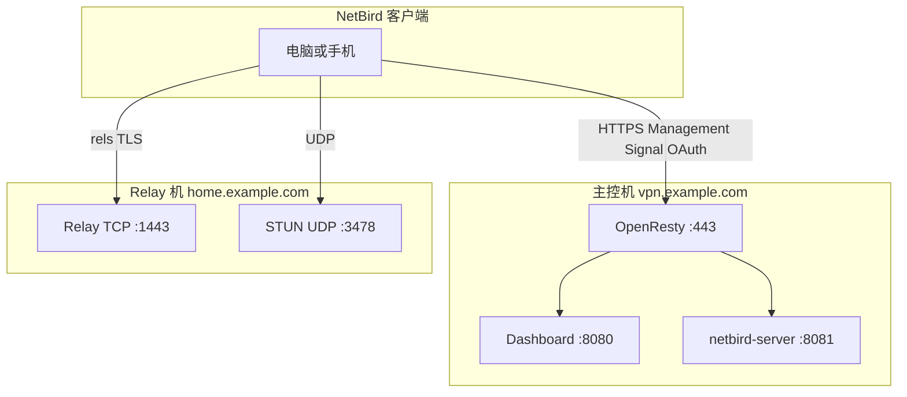

# NetBird 双节点部署指南（1Panel）

本文档说明在 **两台机器** 上分别安装什么、填什么、改哪些文件，以及如何验证组网是否成功。

- **主控机**：完整 NetBird（Management / Signal / Dashboard），域名示例 `vpn.example.com`
- **Relay 机**：仅 **NetBird Relay**（STUN + Relay），域名示例 `home.example.com`；若 80/443 已被占用，Relay TCP 常用 **1443**

下文用 **主控机**、**Relay 机** 称呼；请替换为你的主机名与域名。

---

## 一、架构总览



| 角色 | 安装应用 | 公网域名 | 公网端口 |
|------|----------|----------|----------|
| **主控机** | NetBird | `vpn.example.com` | TCP 80、443（OpenResty） |
| **Relay 机** | NetBird Relay | `home.example.com` | TCP 1443（或 443）、UDP 3478 |

| 能力 | 提供方 | 客户端地址示例 |
|------|--------|----------------|
| 控制台、OAuth、Management、gRPC | 主控机 | `https://vpn.example.com` |
| STUN | Relay 机 | `stun:home.example.com:3478` |
| Relay | Relay 机 | `rels://home.example.com:1443` |

---

## 二、安装应用包

```bash
cd /opt/Netbird-for-1panel
bash install.sh
```

**1Panel → 应用商店 → 更新应用列表** 后：

| 机器 | 安装 |
|------|------|
| 主控机 | **NetBird** latest |
| Relay 机 | **NetBird Relay** latest |

---

## 三、Relay 机（仅 Relay 机执行）

### 3.1 前置

- `home.example.com` 解析到 Relay 机公网 IP
- 防火墙：**TCP 1443**（或所选 Relay 端口）、**UDP 3478**
- 443 已被 OpenResty 占用时，Relay TCP 用 **1443**，勿占 443

### 3.2 安装表单

| 字段 | 示例 | 说明 |
|------|------|------|
| Relay 公网域名 | `home.example.com` | 不带 `https://` |
| Relay 认证密钥 | 与主控 `relays.secret` 一致 | 可含 `/+=` |
| TLS 模式 | `custom_cert` | |
| 证书 / 私钥路径 | 宿主机绝对路径 | 可从 1Panel 站点 SSL 目录复制 |
| Relay TCP 端口 | `1443` | `rels://` 与容器内同端口 |
| STUN UDP | `3478` | 默认 |

**高级设置**

| 选项 | 建议 |
|------|------|
| **端口外部访问** | **必须勾选**（否则仅 127.0.0.1，公网不可达） |
| 绑定主机 IP | 留空 |

可选：实例 `.env` 增加 `HOST_IP=` 消除 Compose 的 `HOST_IP is not set` 警告。

### 3.3 安装后文件

路径示例：`/opt/1panel/apps/local/NetbirdRelay/<实例>/data/`

| 文件 | 用途 |
|------|------|
| `main-server-config-snippet.yaml` | 粘贴到**主控机** `config.yaml` |
| `relay.env` | 含 `NB_AUTH_SECRET`、`NB_EXPOSED_ADDRESS` |

### 3.4 验证（Relay 机）

```bash
ss -lntp | grep 1443
ss -lnup | grep 3478
curl -vk --noproxy '*' "https://home.example.com:1443/"
docker logs <Relay容器名> 2>&1 | tail -15
```

成功：`0.0.0.0:1443`、UDP 3478、TLS 握手成功（**HTTP 404 正常**）、日志含 `rels://home.example.com:1443`。

---

## 四、主控机（仅主控机执行）

### 4.1 前置

- `vpn.example.com` 解析到主控机
- 防火墙：**TCP 80、443**
- 已装 1Panel OpenResty

### 4.2 安装表单（NetBird）

| 字段 | 示例 | 说明 |
|------|------|------|
| 公网域名 | `vpn.example.com` | |
| Dashboard 本机端口 | `8080` | 固定 127.0.0.1，OpenResty 反代 |
| 管理/API 本机端口 | `8081` | 固定 127.0.0.1，含 gRPC |
| STUN UDP | `3478` | 双节点下可不在主控映射（见 4.5） |
| Relay 认证密钥 | 与 Relay 机相同 | 写入 `relays.secret` |

**端口外部访问**：Dashboard/API **不会**因此被暴露；公网走网站 443。STUN 若在 Relay 机提供，主控可不依赖此勾选项放行 STUN。

### 4.3 OpenResty（必做）

不能只在面板里「反代到 8080」，必须包含 **gRPC**：

```bash
DOMAIN="vpn.example.com"
PANEL="/opt/1panel"
cp -f /path/to/Netbird-for-1panel/docs/openresty/proxy/netbird-server.conf \
      "${PANEL}/www/sites/${DOMAIN}/proxy/"
cp -f /path/to/Netbird-for-1panel/docs/openresty/proxy/root.conf \
      "${PANEL}/www/sites/${DOMAIN}/proxy/"
OR=$(docker ps --format '{{.Names}}' | grep -i openresty | head -1)
docker exec "$OR" openresty -t && docker exec "$OR" openresty -s reload
```

详见 [openresty/1panel-openresty.md](openresty/1panel-openresty.md)。

### 4.4 主控 `config.yaml`（核心）

路径：`/opt/1panel/apps/local/Netbird/<实例>/data/config.yaml`

从 Relay 机 `data/main-server-config-snippet.yaml` 合并，或手写：

```yaml
server:
  listenAddress: ":80"
  exposedAddress: "https://vpn.example.com:443"

  stuns:
    - uri: "stun:home.example.com:3478"
      proto: "udp"

  relays:
    addresses:
      - "rels://home.example.com:1443"
    secret: "<与 Relay 机 NB_AUTH_SECRET 完全相同>"
    credentialsTTL: "24h"

  # authSecret: "..."    # 外部 Relay 模式下注释掉
  # stunPorts:           # STUN 在 Relay 机时注释掉

  auth:
    issuer: "https://vpn.example.com/oauth2"
    # dashboardRedirectURIs、cliRedirectURIs 等保持主控域名
```

**勿写** `rels://vpn.example.com` 或 `:443` 作为主 Relay 地址（除非刻意使用主控内置 Relay）。

修改后：

```bash
docker restart <CONTAINER_NAME>-server
docker logs <CONTAINER_NAME>-server 2>&1 | grep -i relay | tail -10
```

期望：

```text
Relay: false
Relay addresses: [rels://home.example.com:1443]
```

| 日志 | 含义 |
|------|------|
| `Relay: false` | 外部 Relay，正确 |
| `Relay: true` + `vpn:443` | 内置 Relay，需改配置 |
| `rels://vpn...` | 仍指主控，错误 |

### 4.5 可选：主控删除 STUN 映射

STUN 全部由 Relay 机提供时，编辑主控 `docker-compose.yml`，删除：

```yaml
- "${HOST_IP}${PANEL_APP_PORT_STUN}:${PANEL_APP_PORT_STUN}/udp"
```

### 4.6 主控验证

```bash
curl -sk "https://vpn.example.com/oauth2/.well-known/openid-configuration" | head
```

浏览器打开 `https://vpn.example.com/setup` 或 Dashboard 能登录。

---

## 五、客户端验证

```bash
netbird down && netbird up
netbird status -d
```

| 项 | 期望 |
|----|------|
| Management | Connected |
| STUN | Available → `home.example.com:3478` |
| Relay | Available → `rels://home.example.com:1443` |

peer 互 ping NetBird IP；Dashboard → Peers 为 Connected。

---

## 六、检查清单

**Relay 机**

- [ ] 只装 NetBird Relay
- [ ] 勾选端口外部访问
- [ ] `0.0.0.0:1443`、UDP 3478
- [ ] TLS 1443 可握手
- [ ] 密钥已给主控 `relays.secret`

**主控机**

- [ ] 只装 NetBird
- [ ] OpenResty 已配 proxy 片段
- [ ] `stuns`/`relays` 指向 Relay 机
- [ ] `authSecret` 已注释
- [ ] 日志 `Relay: false` + `home:1443`

**客户端**

- [ ] `status -d` STUN/Relay Available
- [ ] peer 可 ping

---

## 七、实例参考（happyladysauce.cn）

| 角色 | 主机 | 域名 | 端口 |
|------|------|------|------|
| 主控 | www | vpn.happyladysauce.cn | 443（OpenResty） |
| Relay | home | home.happyladysauce.cn | TCP 1443、UDP 3478 |

---

## 八、相关文档

- [Netbird/README.md](../Netbird/README.md)
- [NetbirdRelay/README.md](../NetbirdRelay/README.md)
- [openresty/1panel-openresty.md](openresty/1panel-openresty.md)
- [官方 External Relay](https://docs.netbird.io/selfhosted/maintenance/scaling/set-up-external-relays)

---

## 九、故障速查

| 现象 | 处理 |
|------|------|
| 主控 `Relay: true` | 改 `config.yaml`，用外部 `relays` |
| 主控 `rels://vpn...` | 改为 `home...:1443` |
| Relay 无 `0.0.0.0:1443` | 勾选端口外部访问并重装 |
| 客户端 Relay Unavailable | 核对 `relays.secret` |
| 主控连不上 | 检查 OpenResty gRPC 配置 |
